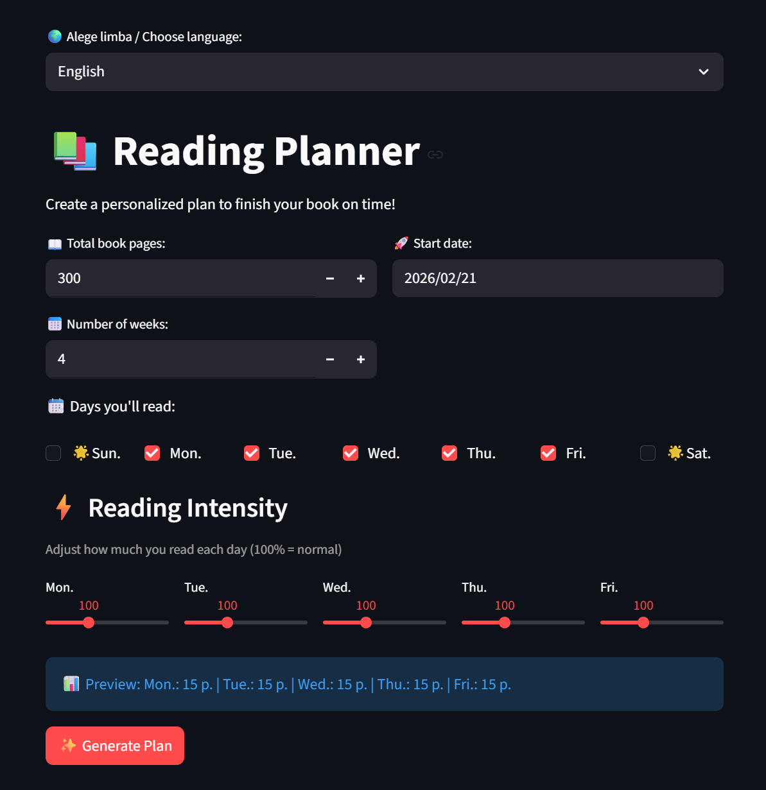

# 📚 Reading Planner

A simple Streamlit app that generates a personalized reading plan to help you finish any book on time — with custom intensity per day and bilingual support (English 🇬🇧 / Romanian 🇷🇴).



---

## ✨ Features

- Set total book pages, number of weeks, and start date
- Choose which days of the week you want to read
- Adjust reading intensity per day (50% → chill day, 200% → power session)
- Generates a day-by-day plan with exact page targets
- Bilingual UI: **English** and **Română**

---

## 🛠️ Installation

**Requirements:** Python 3.8+

```bash
# Clone the repo
git clone https://github.com/your-username/reading-planner.git
cd reading-planner

# Install dependencies
pip install streamlit

# Run the app
streamlit run app.py
```

---

## 🚀 Usage

1. Select your language (English / Română)
2. Enter the total number of pages in your book
3. Set how many weeks you have to finish it
4. Pick a start date and the days you'll read
5. Adjust intensity sliders per day (optional)
6. Hit **✨ Generate Plan** — done!

The app will output a week-by-week breakdown with daily page targets and cumulative progress.